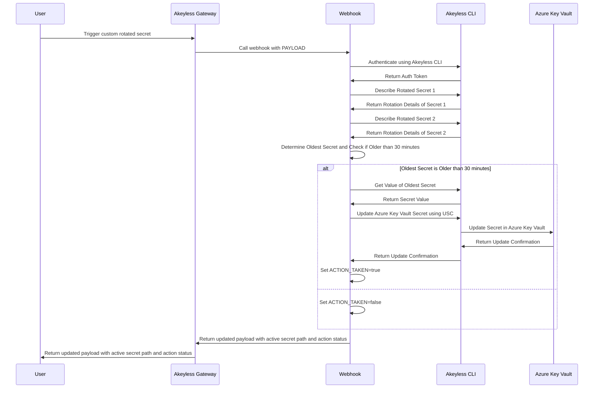

# Legacy Azure Key Vault Svc Principal Rotation

This example shows how to rotate a service principal secret and store them inside Azure Key Vault. This method is designed to show how you can use Akeyless to rotate secrets in a legacy process and then work the organization towards migrating to dynamic secrets.

The same custom server webhook can be used by multiple custom rotated secrets to rotate different secrets and you can scale horizontally to rotate secrets in parallel.

## Legacy Process

Azure Service principal secrets often suffer from replication lag. A legacy process was devised to rotate the service principal secret for two Azure service principals in a way that was not disruptive to the service similar to "blue/green" deployments. The legacy process is as follows:

1. Create a new Azure Rotated Secret for the "blue" service principal
2. Create a new Azure Rotated Secret for the "green" service principal
3. Update an Azure Key Vault Secret to store the "blue" service principal credentials
4. Trigger the rotation of the "blue" service principal secret
5. After a specific time period, replace the old Azure Rotated Secret for the "green" service principal
6. Update the Azure Key Vault Secret to store the "green" service principal credentials
7. Trigger the rotation of the "green" service principal secret
9. Wait a specific time period
10. Repeat steps 3-10

## Akeyless Implementation



## Prerequisites

- Create a new Azure Rotated Secret for the "blue" service principal (rotated_secret_1_path)
- Create a new Azure Rotated Secret for the "green" service principal (rotated_secret_2_path)
- Create a Universal Secrets Connector for the Azure Key Vault (usc_path)
- Deploy this custom server to a kubernetes cluster with the configuration under the example-scripts/legacy-azure-key-vault-svc-principal-rotation directory and the changes to the kustomization.yml file that accompany that directory
- Create a new custom web target pointing to the new custom server endpoint
- Create a new custom rotated secret that points to the new custom web target and setup auto-rotation
- Make sure the Kubernetes cluster where the custom server is deployed has k8s authentication set up within Akeyless
- Create a new Access Role that grants the custom server, using the k8s auth method, access to the two rotated secrets and the Universal Secrets Connector


## Example Starting Payload

```json
{
  "access_id": "p-oki4w02qfz9c",
  "k8s_auth_config_name": "cg-lab-aks",
  "gateway_url": "https://gw-config.cg2.cs.akeyless.fans",
  "rotated_secret_1_path": "/Azure KV Cg Rotated Secret 1",
  "rotated_secret_2_path": "/Azure KV Cg Rotated Secret 2",
  "azure_key_vault_secret_id": "https://cg-akl.vault.azure.net/secrets/azure-sp-ready",
  "usc_path": "/AKV - USC - cg-akl"
}
```

## Payload Fields Explanation

The payload required for the custom rotated secret contains several fields. Below is an explanation of each field based on the existing documentation and the `custom_logic.sh` script:

- `access_id`: The access ID used to authenticate using Kubernetes Auth with the Akeyless CLI. This is required to obtain a token for further API calls.
- `k8s_auth_config_name`: The name of the Kubernetes authentication configuration. This is used to authenticate the custom server with Akeyless using the Kubernetes authentication method.
- `gateway_url`: The Gateway Cluster URL of the Akeyless Gateway that the k8s auth is configured on.
- `rotated_secret_1_path`: The path to the first Azure rotated secret. This is used to describe and retrieve the details of the first rotated secret.
- `rotated_secret_2_path`: The path to the second Azure rotated secret. This is used to describe and retrieve the details of the second rotated secret.
- `azure_key_vault_secret_id`: The ID of the Azure Key Vault secret. This is used to update the Azure Key Vault secret with the value of the rotated secret.
- `usc_path`: The path to the Universal Secrets Connector (USC). This is used to update the Azure Key Vault secret using the USC.

These fields are necessary for the custom server to authenticate with Akeyless, describe the rotated secrets, determine the oldest secret, and update the Azure Key Vault secret accordingly.

## Troubleshooting

You can exec into the custom server pod and run these commands to more closely debug any issues with your custom bash script.

```bash
# Save the payload to a file
cat <<EOF > payload.json
{
  "payload": {
    "access_id": "p-oki4w02qfz9c",
    "k8s_auth_config_name": "cg-lab-aks",
    "gateway_url": "https://gw-config.cg2.cs.akeyless.fans",
    "rotated_secret_1_path": "/Azure KV Cg Rotated Secret 1",
    "rotated_secret_2_path": "/Azure KV Cg Rotated Secret 2",
    "azure_key_vault_secret_id": "https://cg-akl.vault.azure.net/secrets/azure-sp-ready",
    "usc_path": "/AKV - USC - cg-akl"
  }
}
EOF

# Encode the payload in base64
BASE64_PAYLOAD=$(base64 -w 0 payload.json)

# Source the script to make the function available in the current shell
source custom_logic.sh

set -x

# Call the function with the base64-encoded payload
run_rotate "$BASE64_PAYLOAD"
```
